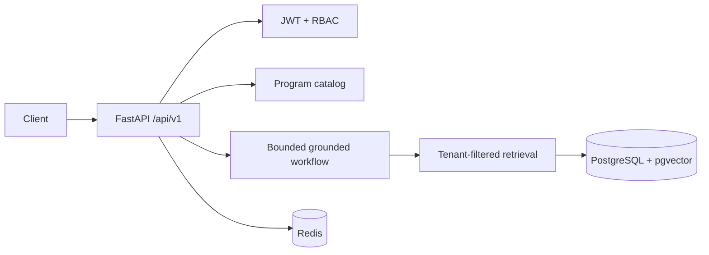

# EduKnowledge AI Backend

A demo-only backend for a source-grounded higher-education knowledge assistant

## Foundation scope

This first work unit provides a typed FastAPI runtime, JSON logs, liveness/readiness probes, and local PostgreSQL/pgvector plus Redis infrastructure. Authentication, database models/migrations, RAG, demo data, and evaluations are introduced in later work units.

## Prerequisites

- Python 3.12+
- Docker Compose v2 (for the local infrastructure stack)

## Local development

```bash
cp .env.example .env
python -m venv .venv
. .venv/bin/activate
pip install -e '.[dev]'
pytest
make lint
uvicorn app.main:app --reload
```

Open <http://localhost:8000/docs>. Liveness is `GET /api/v1/health`; readiness is `GET /api/v1/ready`. Readiness returns HTTP 503 and boolean dependency states when PostgreSQL or Redis cannot be reached, without exposing credentials or exception details.

The example environment targets PostgreSQL and Redis exposed on `localhost` for host-based
development. Docker Compose overrides those two URLs with the internal service hostnames. The
default CORS allow-list accepts the frontend at `localhost:3000` and `127.0.0.1:3000`; replace it
with the deployed frontend origins outside local development.

## Docker

```bash
cp .env.example .env
make up
curl http://localhost:8000/api/v1/health
curl http://localhost:8000/api/v1/ready
make logs
make down
```

`make migrate` is reserved for the Alembic baseline delivered with the persistence work unit. `make seed` and `make eval` are intentionally no-ops until their respective demo-data and quality work units are delivered.

## Quality commands

```bash
make test
make lint
make format
```

All credentials and provider keys belong in environment variables; never commit `.env`. The supplied Compose database password is local-development-only.

## Architecture



Routes are thin; services own domain behavior, repositories apply `organization_id` filters, and external provider boundaries permit deterministic local behavior. PostgreSQL plus pgvector keeps relational program data and future vector retrieval in one operational store. Controlled tools, citation validation, and abstention prevent unsupported answers.

## Threat model and limitations

- JWT identity and role checks gate protected routes; repositories scope records by organization.
- Documents are untrusted evidence, never executable instructions. URL ingestion requires HTTPS and allow-listed hosts.
- Chat refuses common injection instructions, bounds local rate limits, and abstains when evidence is missing.
- This portfolio project has no institutional affiliation and seed content is explicitly demo-only.
- PDF extraction, durable job queues, provider adapters, database migrations, and production distributed rate limits require further operational hardening.

## Evaluation

`seed/evaluation_cases.json` provides 30 labeled demo cases across admissions, scholarships, programs, regulations, no-answer, and injection prompts. The reporting service writes JSON and Markdown summaries. Recall@k and citation validity are mechanical metrics; groundedness is explicitly a heuristic, not an objective model-quality claim.
