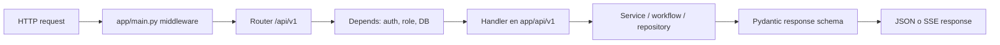

# Aprender Python y FastAPI desde este proyecto

Este backend es una API de FastAPI. Si vienes aprendiendo Python mediante proyectos, la mejor forma de leerlo es seguir una petición completa en vez de intentar memorizar todos los archivos.

## 1. Python que aparece todo el tiempo

### Type hints

```python
async def login(payload: LoginRequest, request: Request, db: AsyncSession) -> TokenResponse:
```

Python no obliga estos tipos en tiempo de ejecución como TypeScript. Aquí sirven para tres cosas:

1. FastAPI sabe cómo validar y documentar `payload`.
2. Tu editor puede autocompletar `db`, `request` y la respuesta.
3. `mypy app` encuentra errores antes de ejecutar el programa.

`str | None` significa “texto o `None`”, parecido a `string | null` de TypeScript. `list[Evidence]` equivale a `Evidence[]`.

### Clases y modelos

- Las clases de `app/schemas/` son modelos Pydantic: validan datos que entran y salen por HTTP.
- Las clases de `app/db/models/` son modelos SQLAlchemy: representan tablas de PostgreSQL.
- Una `dataclass` como `RequestContext` es una clase pequeña para agrupar datos ya válidos.

No mezcles esquema HTTP y tabla de base de datos solo porque sus campos se parezcan. Separarlos permite que cambien con independencia y evita filtrar datos internos.

### `async` y `await`

Una ruta `async def` puede esperar I/O sin bloquear otras peticiones:

```python
user = await db.scalar(select(User).where(User.email == payload.email))
```

No necesitas usar `async` para cálculos cortos y locales, como `hash_password()` o `validate_citations()`. Úsalo al llamar red, base de datos, archivos o Redis.

## 2. Cómo FastAPI encuentra una ruta



El punto de entrada es `app/main.py`:

- `create_app()` configura FastAPI, logging, CORS y el estado de la aplicación.
- `include_router(...)` monta cada grupo de rutas bajo `/api/v1`.
- El middleware asigna `X-Request-ID` y registra duración de cada petición.

Las rutas concretas están en `app/api/v1/`: `auth.py`, `chat.py`, `programs.py` y `health.py`.

## 3. Dependencias: la forma FastAPI de pasar contexto

En React normalmente pasas props o lees un Context. FastAPI usa inyección de dependencias:

```python
async def me(
    context: RequestContext = Depends(current_context),
    db: AsyncSession = Depends(session),
) -> UserResponse:
```

Antes de ejecutar `me()`, FastAPI ejecuta `current_context()` para validar el token Bearer y `session()` para obtener una sesión de base de datos. El handler recibe valores listos para usar.

Estudia estos archivos en este orden:

1. `app/api/v1/dependencies.py` — token, rol y `RequestContext`.
2. `app/api/v1/auth.py` — uso de dependencias en login y `/me`.
3. `app/db/repositories/programs.py` — acceso a datos aislado por organización.

## 4. Dónde vive cada responsabilidad

| Pregunta | Carpeta o archivo |
| --- | --- |
| ¿Cómo arranca la API? | `app/main.py` |
| ¿Qué variables existen? | `app/core/config.py` |
| ¿Qué recibe/devuelve HTTP? | `app/schemas/` |
| ¿Qué endpoint responde? | `app/api/v1/` |
| ¿Cómo se guarda/consulta? | `app/db/models/`, `app/db/repositories/` |
| ¿Cuál es la regla de negocio? | `app/services/`, `app/workflows/` |
| ¿Cómo se prueba? | `app/tests/` |

Una buena práctica al agregar una función es mantener los handlers HTTP finos: valida/autoriza en la ruta y coloca reglas reutilizables en un servicio o workflow.

## 5. Primer recorrido recomendado

1. Ejecuta `uv run pytest -q`.
2. Lee `app/tests/test_health.py`, luego `app/api/v1/health.py`.
3. Sigue login: `schemas/auth.py` -> `api/v1/auth.py` -> `core/security.py`.
4. Sigue chat: `schemas/chat.py` -> `api/v1/chat.py` -> `workflows/rag_graph.py`.
5. Revisa programas para ver modelo, repositorio, servicio y ruta trabajando juntos.

## 6. Comandos útiles

```bash
uv run pytest -q      # pruebas
uv run ruff check app # estilo y errores comunes
uv run mypy app       # chequeo estricto de tipos
uvicorn app.main:app --reload # API local
```

Abre `http://localhost:8000/docs` para inspeccionar y probar los endpoints desde la documentación OpenAPI generada por FastAPI.
