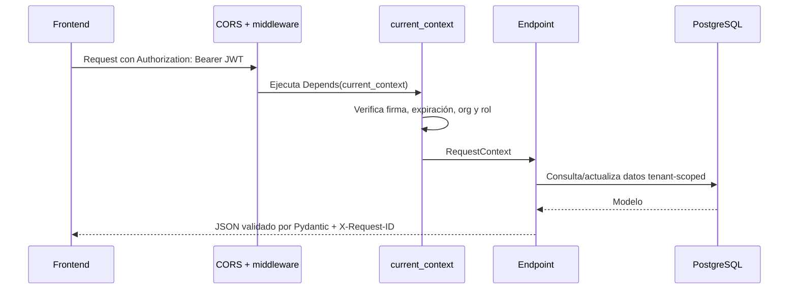
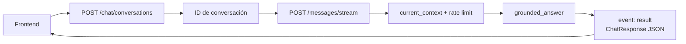

# Flujos del backend

Este documento explica el comportamiento implementado hoy y distingue los límites de la fase actual.

## Flujo de una petición autenticada



`RequestContext` contiene `user_id`, `organization_id` y `role`. Los repositorios reciben el `organization_id`, por lo que una consulta de programas no debe cruzar organizaciones.

## Autenticación

| Endpoint | Qué hace |
| --- | --- |
| `POST /api/v1/auth/register` | Crea organización y administrador; devuelve JWT Bearer. |
| `POST /api/v1/auth/login` | Verifica contraseña scrypt; devuelve JWT Bearer. |
| `GET /api/v1/auth/me` | Valida token y consulta el usuario activo real de su organización. |

El JWT se firma con HS256 en `app/core/security.py`. La contraseña se almacena como un hash scrypt con salt; nunca como texto plano.

## Chat y fuentes



`ChatResponse` contiene respuesta, citas, fuentes recuperadas, latencia, coste estimado y estado de abstención. `grounded_answer()` se niega ante marcadores sencillos de prompt injection y se abstiene si no hay evidencia suficiente.

### Estado actual importante

`local_evidence()` en `app/api/v1/chat.py` todavía devuelve una lista vacía. Por eso el modo live responde con una abstención honesta; no inventa fuentes. Las funciones de retrieval y embeddings existen en `app/services/retrieval/`, pero falta conectarlas con chunks persistidos e ingestión operativa.

El frontend entiende este estado y muestra “no hay suficiente información verificada” en vez de reemplazar el resultado live con datos mock.

## Programas

Las rutas de programas siguen el patrón:

```text
HTTP handler -> ProgramRepository (filtro organization_id) -> SQLAlchemy model
             -> app/services/programs.py para CSV o comparación
             -> ProgramResponse
```

Los lectores pueden listar/consultar/comparar. Admins y editores pueden crear, actualizar, borrar e importar CSV. La autorización se concentra en `require_roles()`.

## Salud e infraestructura

- `GET /api/v1/health`: liveness; confirma que el proceso HTTP responde.
- `GET /api/v1/ready`: readiness; verifica PostgreSQL y Redis y devuelve `503` si alguno falla.
- `app/db/session.py`: crea engine async y cliente Redis.
- `app/main.py`: cierra infraestructura en el lifespan.

## CORS y entornos locales

El frontend se ejecuta en `http://localhost:3000` y la API en `http://localhost:8000`. `CORSMiddleware` usa `EDUKNOWLEDGE_CORS_ORIGINS` para permitir esos orígenes durante desarrollo.

`.env.example` usa `localhost` porque sirve al ejecutar Uvicorn desde tu máquina. `docker-compose.yml` sobrescribe las URLs con `postgres` y `redis`, los nombres internos de Docker.

## Cómo cambiar algo sin perderse

1. Añade o modifica el modelo Pydantic en `app/schemas/`.
2. Implementa reglas en `app/services/` o `app/workflows/`.
3. Añade el acceso persistente en un repositorio si aplica.
4. Crea el endpoint fino en `app/api/v1/`.
5. Escribe un test en `app/tests/`.
6. Ejecuta pytest, Ruff y mypy.

No pongas una regla de negocio grande directamente en una ruta: se vuelve difícil de probar y reutilizar.
